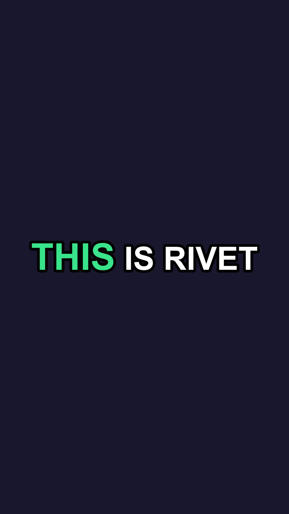

# Rivet

Automatic **viral captions** for short-form video, on Windows. Fully local — the video never
leaves the machine, speech recognition runs on
[ggml-org/whisper.cpp](https://github.com/ggml-org/whisper.cpp).

Point it at a clip. Rivet transcribes the speech, lays the words out as TikTok/Shorts-style
captions with the spoken word highlighted, and **burns them into the video**.



## What it does

```
your video →  [optional] Demucs isolates the vocals
          →  whisper.cpp transcribes it, word by word with timing
          →  EDIT: fix any wrong word, nudge timings, watch a live preview
          →  rendered as animated captions and burned into the video  →  captioned .mp4
```

- **Transcribe → edit → render.** whisper isn't perfect, so you get to fix the text and realign
  words against a live preview frame before the final burn — editing is optional
  ([ADR 0010](docs/decisions/0010-editable-transcript-review.md)).
- **Per-word highlight.** The word being spoken pops in a highlight colour and grows — the
  look people mean by "TikTok captions" ([ADR 0005](docs/decisions/0005-ass-libass-rendering.md)).
- **Your style.** Font, size, text colour, highlight colour, position, words-on-screen and
  uppercase are all yours, and remembered between runs. Sizes scale with the clip, so one
  preset works on 720p and 4K alike ([ADR 0008](docs/decisions/0008-style-as-percent-of-height.md)).
- **Optional vocal isolation.** On music-heavy clips, isolate the voice with Demucs first for a
  cleaner transcript ([ADR 0009](docs/decisions/0009-vocal-isolation.md)). Off by default.
- **Local and offline.** Nothing is uploaded. The speech model downloads once to
  `%LOCALAPPDATA%/Rivet/models`.

## Requirements

- **ffmpeg** and **ffprobe** on your PATH (or in `C:\ffmpeg`). Rivet does not bundle them —
  they are large and any machine editing video already has them
  ([ADR 0002](docs/decisions/0002-ffmpeg-for-media.md)).
- **Demucs** — only if you turn on vocal isolation (`pip install demucs`; `demucs` or
  `python -m demucs` must run). Optional.
- A **discrete GPU** is strongly recommended. Via Vulkan (NVIDIA, AMD or Intel — nothing to
  install) whisper runs faster than real time; on CPU a clip takes many times longer
  ([ADR 0004](docs/decisions/0004-cpu-or-gpu.md)). Pick **Fast** quality on a weak machine.

## Run it from source

```
dotnet run --project src/Rivet.App
```

Open it, choose a video, tune the caption look, press **Generate captions**. The first run
downloads the speech model (Balanced ≈ 1.5 GB, once).

## Layout

| Path | What |
|---|---|
| [architecture.md](architecture.md) | how it fits together — read this first |
| [docs/decisions/](docs/decisions/) | why it is built this way |
| [src/Rivet.Core/](src/Rivet.Core/) | ffmpeg media, whisper.cpp transcription, subtitles, pipeline |
| [src/Rivet.App/](src/Rivet.App/) | Avalonia UI |

## Conventions

Max 300 lines per file. `Rivet.Core` must not reference Avalonia; ffmpeg and whisper.cpp are
reached only through `IMediaProcessor` / `ITranscriber`. Every non-obvious decision gets an ADR.
